
 

# **Sistema de gestión de  inventario para farmacias (SISFARMA)**

## 
 PLANTEAMIENTO DEL PROBLEMA 

La farmacia “Medilife” evidencia problemáticas en el área de ventas, registro de los productos y proveedores ya que el administrador y dueño del negocio, no tiene un control de los productos que compra y vende, además sus trabajadores al momento de efectuar las ventas o recibir nuevos productos no registran de manera adecuada ni con frecuencia los medicamentos, la droga blanca y los variados productos de cuidado personal. Este negocio cuenta con un sistema deficiente de registro de ventas,es decir, no abarca toda la información que debe ser registrada solo registra las ventas más importantes y guarda un simple registro que al momento de ser utilizado en un inventario no es completo además la información de los productos nuevos, próximos a vencerse, proveedores, clientes más importantes y algunas ventas no son registradas en el actual sistema, el único registro que se tiene de estos se hace de forma manual y desordenada generando así pérdida de información, dinero e incluso se puede lcomlegar a poner en riesgo la salud de los clientes dado el caso de que se encuentre disponible a la venta un producto próximo a vencer o en el peor de los casos ya vencido.

## 
PROCESO ACTUAL

Actualmente en la farmacia “Medilife” el proceso se lleva a cabo de la siguiente manera:

Cada vez que se reciben nuevos medicamentos, se hace un registro en una libreta de que la entrega fue recibida en la fecha que corresponda al día, sin embargo no se hace un inventario adecuado de lo recibido, razón por la cual, en la mayoría de los casos no se puede determinar si los productos fueron vendidos en su totalidad o si por el contrario hubo alguna pérdida o robo. También es necesario realizar un tanteo (que puede ser o no exacto), para determinar en qué momento se está agotando alguno de los medicamentos, por lo que, en momentos puede haber indisponibilidad de productos.

Al momento de efectuar una venta se hace un registro de forma manual, que indique el producto vendido y el valor del mismo, esto no se hace frecuentemente, por lo tanto al momento de realizar la cuenta del valor total de las ventas del día, no es un valor exacto, esto puede generar pérdidas de dinero.

## 
 JUSTIFICACIÓN 

La farmacia  medilife en su actual funcionamiento y con las  problemáticas evidenciadas, dan como resultado un proceso inadecuado y poco conveniente para  la  misma. Por lo tanto, se llegó a la conclusión de  desarrollar un sistema de software que responde al nombre de SisFarma que se encargará de hacer un inventario en tiempo real, el cual permitirá tener un registro y gestión  de los productos, proveedores, ventas y clientes permitiendo  así  tener  un control total de  todos los  factores que implica este negocio. SisFarma será desarrollado con las siguientes tecnologías: React.js para el Frontend (vista para el usuario), MongoDB para almacenar todos los datos del sistema (BASE de DATOS), Node.js  (para la lógica del negocio). Dando como resultado un sistema amigable para  el usuario, fácil de manejar  y lo mejor que de todo flexible, ya que, este sería adaptable para otros negocios que tienen su actual funcionamiento en el mundo farmacéutico.

## 
DESCRIPCIÓN DE LA PROPUESTA 

teniendo en cuenta las problemáticas evidenciadas anteriormente que se basan en un mal manejo de la información de la farmacia  Medilife y los riesgos que se están asumiendo que son poco convenientes para el negocio. se plantea desarrollar  un sistema de software que permita reducir a cero los procesos manuales a través de un inventario en tiempo real dando como resultado un sistema inclusivo que permita una mejor  interacción por parte de todas las personas que hacen posible el funcionamiento de la farmacia y lo más importante un sistema de software que permita hacer un inventario y tener un registro acertado de ventas poniendo en uso la información de los  proveedores, productos, ventas y clientes del sistema. La ventaja de desarrollar un sistema que abarque estos procesos es que brinda confianza, ya que, estaría ofreciendo  al usuario productos previamente revisados, teniendo así un histórico de cada uno, un registro de ventas que permitirá saber cual es el comportamiento de estas según los días  de la semana, un registro de los clientes más frecuentes para saber si aplican a un descuento. en conclusión tener la información siempre a la mano para conocer el comportamiento de la farmacia y que por medio de esta se puedan ver los ingresos, cantidad de producto disponible  y ventas realizadas. 

SisFarma por medio de un sistema fácil de manejar y agradable para el usuario permitirá lo siguiente:

1. Que el administrador  y dueño del negocio pueda ver en tiempo real los productos activos, los que se encuentran a punto de vencerse  y en definitiva los que  no tienen un buena acogida  comercial y en lugar de  generar  ingresos generan pérdidas para el negocio.

2. Que el proceso de ventas se encuentre sistematizado   

3. Tener a la  mano el total de las ventas realizadas o saber en cualquier  momento el comportamiento de las mismas.

*Nota: por cuestiones tiempo en este primer ciclo de desarrollo del proyecto no se desarrollara nada relacionado con los clientes ya que hay otros  procesos con más prioridad que deben ser atendidos lo más  pronto posible para forjar desde un sistema más acertado*

Para el desarrollo de este proyecto se  utilizaran las siguientes tecnologías:

1.React.js : Para la vista del usuario (Front-end) por que permite un desarrollo más ordenado, ágil y con menos código  sin dejar a un lado la calidad de desarrollo. 

2.MongoDB: para almacenar todos los datos del sistema (BASE de DATOS) por que es una base de datos NoSQL lo cual la hace mas rapida y eficiente , además de que no es necesario hacer en esquema de entidad relación ayudándonos a una implementación mucho más ágil. 

3.Node.js  (para la lógica del negocio)   por que nos permite programar de con Javascript desde el lado del servidor y del cliente con un excelente rendimiento y permitiendo un desarrollo muchas más rápido.  

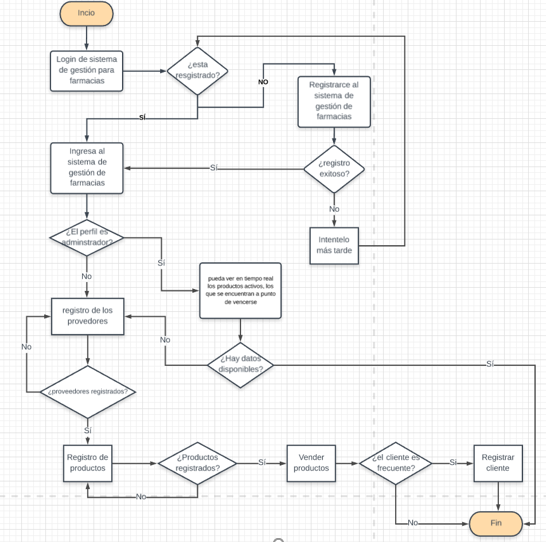

### Observaciones Entregable Uno.
- Más orden al momento de presentar la idea.
- Es importante al momento de justificar que se tiene un cliente real mostrar evidencias de ese proceso (firmas de los requesitos funcionales, actas de reuniones y aspectos de validación de entregables).
- La nota presente aplica para las personas que estuvieron el día de la presentación, quienes no lo estuvieron tiene 0.5 menos al valor de esta nota.
- No encuentro información de las personas involucradas en este proyecto.

#### Nota: 4,5

 

# Prototipos del sistema de gestión de farmacias (SisFarma)

## 
 Inicio de sesión 

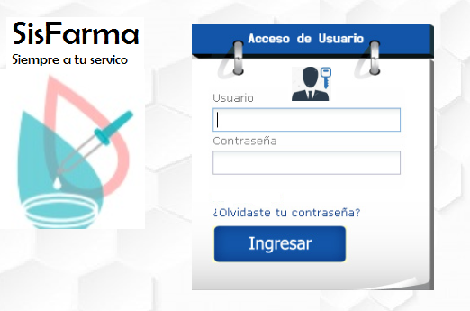

## 
Menú del sistema

Cabe aclarar que dependiendo de los perfiles a los cuales pertenezcan los  usuarios tendrán los  permisos para  ingresar  a las  opciones del sistema, es decir, si es el adiestrador  tendrá acceso  a  todo. Por el contrario si es un vendedor solo podrá acceder a las  ventas, productos, y proveedores pero este no podrá eliminarlos  el único que tiene  permiso es el administrador.

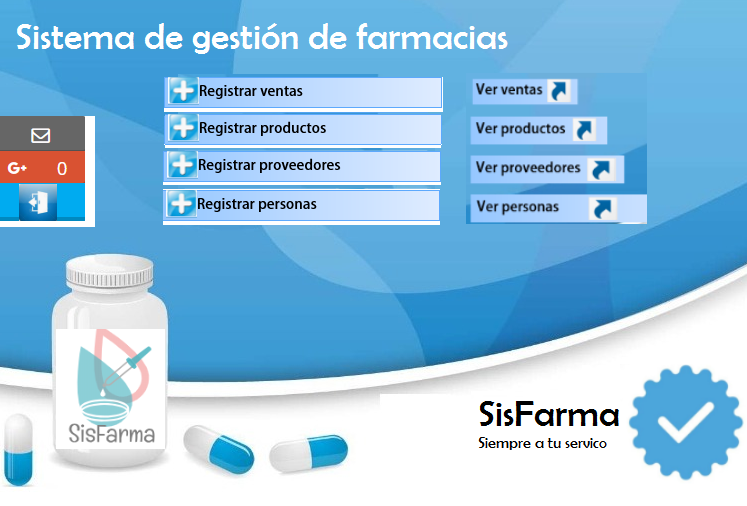

## 
 Personas 

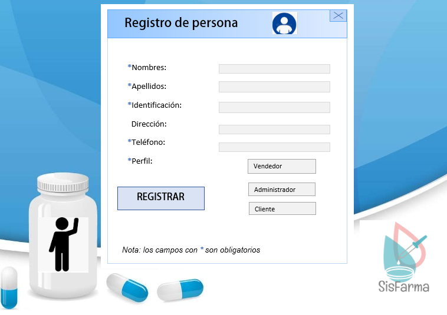

Una vez las personas se encuentren registradas  aparecerán  cada  uno  de  los registros en una tabla en  donde se  podrán modificar o eliminar.

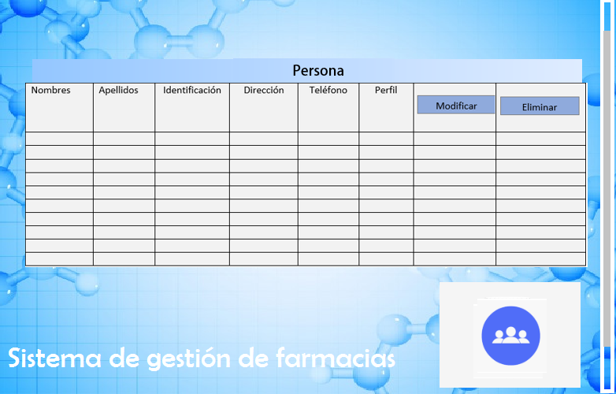

## 
Registro de ventas

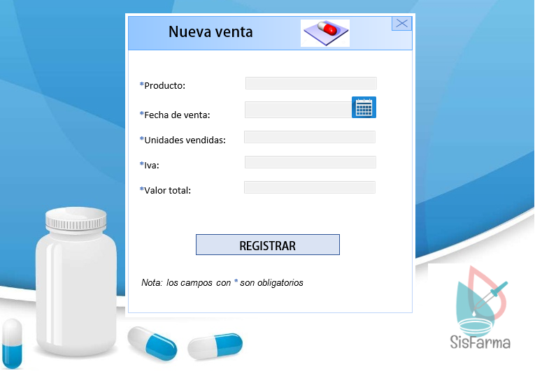

## 
Ventas

Una vez la ventas se encuentren registradas  aparecerán  cada  uno  de  los registros en una tabla, en  donde se  podrán modificar o eliminar.

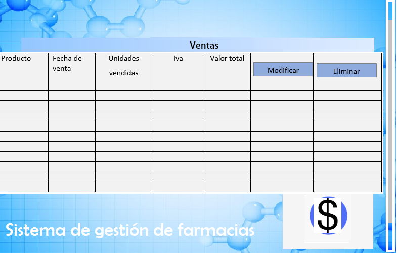

## 
Productos

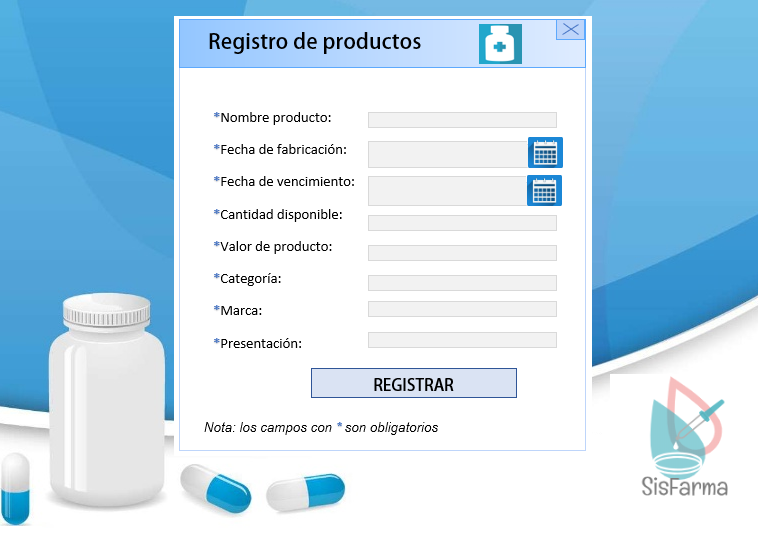

Una vez los productos se encuentren registrados  aparecerán  cada  uno  de  los registros en una tabla, en  donde se  podrán modificar o eliminar.

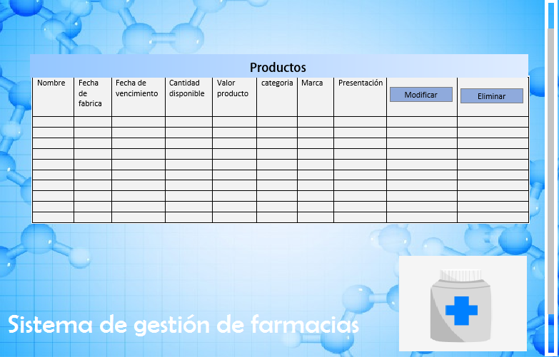

## 
Proveedores

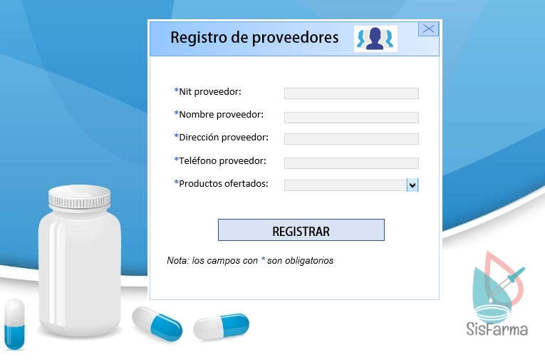

Una vez los proveedores se encuentren registrados  aparecerán  cada  uno  de  los registros en una tabla, en  donde se  podrán modificar o eliminar.

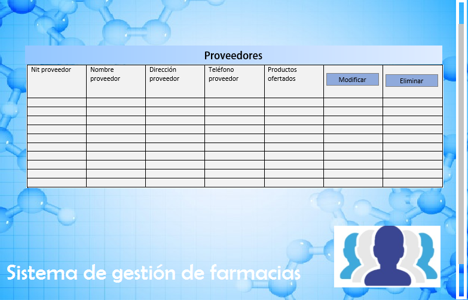
