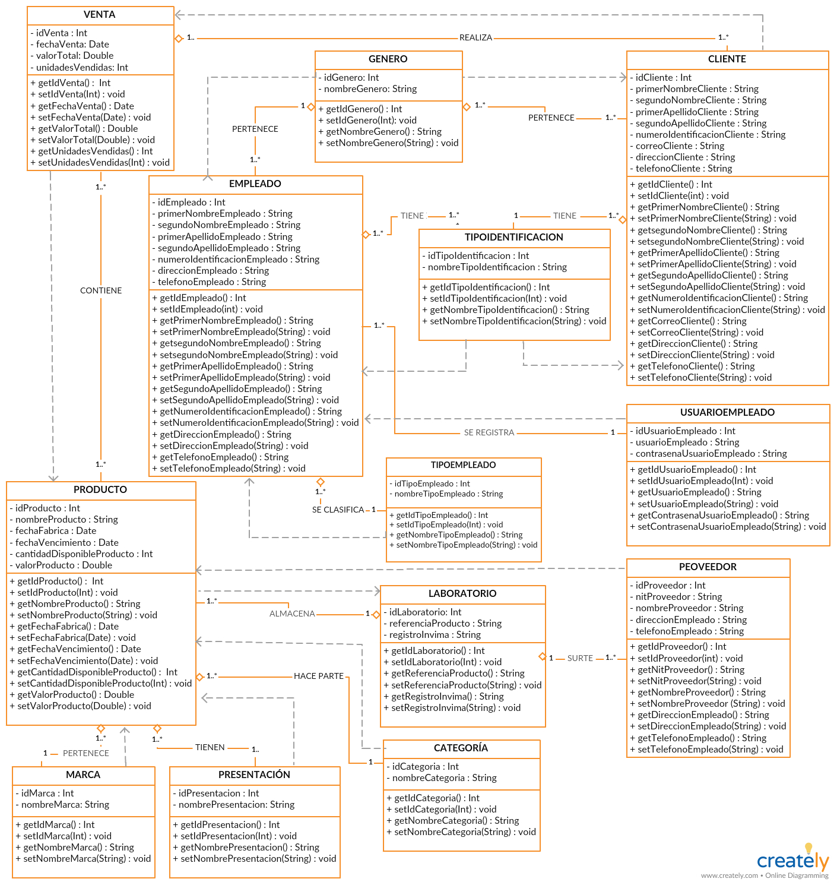

 

# **Sistema de gestión de  inventario para farmacias (SISFARMA)**

 

# Diagrama de clases (SisFarma)

El diagrama de clases presenta las siguientes características:

1. CLASES:  
* Venta. 
* Cliente. 
* Género. 
* Empleado.  
* Tipo de identificación. 
* Usuario empleado. 
* Productos. 
* Tipo empleado. 
* Laboratorio. 
* Proveedor. 
* Marca.  
* Presentación. 
* Categoría.  

2. RELACIONES:  
* ventas- cliente: uno/muchos a uno/muchos.  
* ventas- producto: uno/muchos a uno/muchos. 
* cliente- género: uno/muchos a uno. 
* género- empleado: uno a uno/muchos.  
* empleado- tipo identificación: uno/muchos a uno. 
* tipo identificación- cliente: uno a uno/muchos. 
* empleado- usuario empleado: uno/muchos a unos. 
* empleado- tipo empleado: uno/muchos a uno. 
* producto- laboratorio: uno/muchos a uno. 
* laboratorio-proveedor: uno a uno/muchos. 
* producto- marca: uno/muchos a uno. 
* producto- categoría: uno/muchos a uno. 
* producto- presentacíon: uno/muchos a uno. 

3. COMPOSICIÓN:  
* ventas- cliente: agreación. 
* ventas- producto: asociación. 
* cliente- género: agreación. 
* género- empleado: agreación.  
* empleado- tipo identificación: agreación. 
* tipo identificación- cliente: agreación. 
* empleado- usuario empleado: asociación. 
* empleado- tipo empleado: agreación. 
* producto- laboratorio: agreación. 
* laboratorio-proveedor: agreación. 
* producto- marca: agreación. 
* producto- categoría: agreación. 
* producto- presentacíon: agreación. 

4. CONECTORES:  
* ventas (REALIZA) cliente. 
* ventas (CONTIENE) producto. 
* cliente (PERTENECE) género. 
* género (PERTENECE) empleado.  
* empleado (TIENE) tipo identificación. 
* tipo identificación (TIENE) cliente. 
* empleado (SE REGISTRA) usuario empleado. 
* empleado (SE CLASIFICA) tipo empleado. 
* producto (ALMACENA) laboratorio. 
* laboratorio (SURTE) proveedor. 
* producto (PERTENECE) marca. 
* producto (HACE PARTE) categoría. 
* producto (TIENE) presentacíon. 

4. DEPENDENCIAS:  
* cliente DEPENDE venta. 
* ventas DEPENDE producto. 
* género DEPENDE cliente. 
* género DEPENDE empleado.  
* tipo identificación DEPENDE empleado. 
* tipo identificación DEPENDE cliente. 
* usuario empleado DEPENDE empleado. 
* tipo empleado DEPENDE empleado. 
* producto DEPENDE laboratorio. 
* proveedor DEPENDE producto. 
* marca DEPENDE producto. 
* categoría DEPENDE producto. 
* presentacíon DEPENDE producto. 

